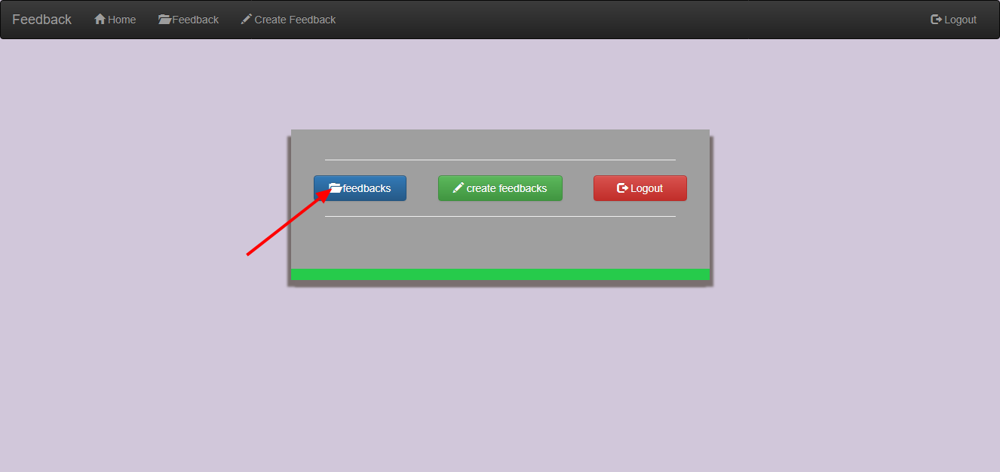

# FeedBack
  Hello Geeky Friends!!! I am Ajay from Karpagam College Of Engineering. This Project is a simple feedback
app developed by me at the time I have learned Django . This Project has Three modules superuser,student and faculty.
The superuser can filter and view the feedback submissions. The Student can give feedback to the staff and versa

## Test Link
<a href="https://feed102.herokuapp.com/">Click Here</a>

## Screen Shots

